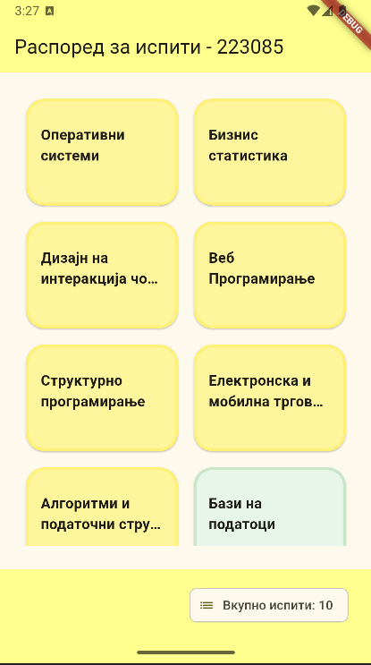
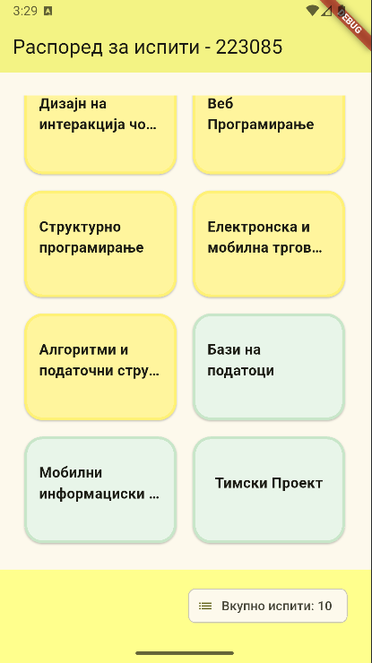
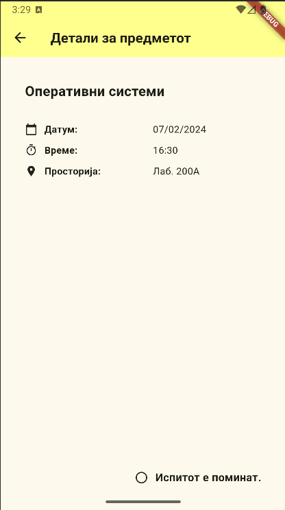
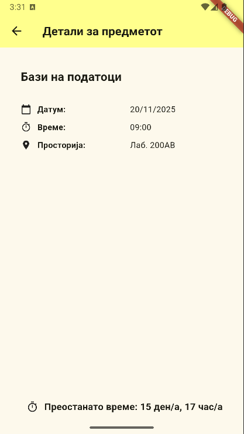

# Exam Schedule - Flutter App

This Flutter application displays exams in a schedule.
Passed exams are highlighted in **yellow**, while upcoming/future exams are highlighted in **green**.  
By clicking on any exam, a detailed view opens showing information about the selected exam. 
The details include **date**, **time**, and **room**. 
At the bottom of the screen, it shows whether the exam has already passed, or if not, it calculates the remaining **days and hours** until the exam.

### Home Screens

### Details Screens

